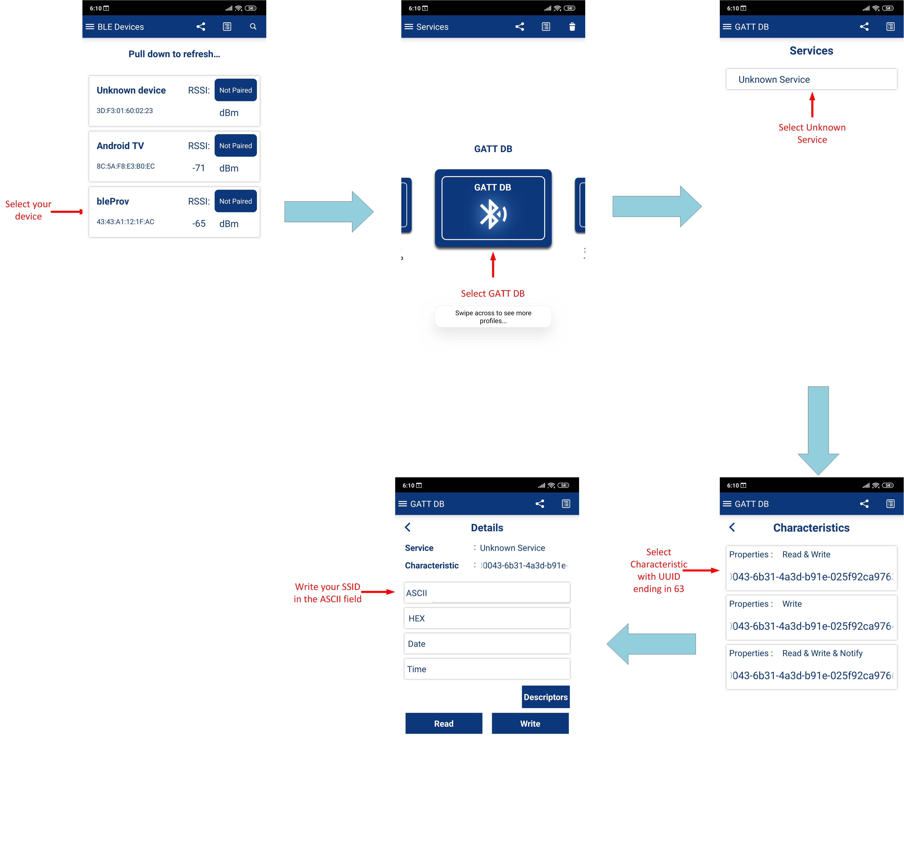

# AnyCloud: Wi-Fi Onboarding Using Bluetooth LE

This example uses the Arm® Cortex®-M4 (CM4) CPU of PSoC® 6 MCU to communicate with the CYW43xxx combo devices and control the Wi-Fi and Bluetooth LE functionality. It uses Bluetooth LE on the combo device to help connect the Wi-Fi to the AP. It also enables low-power mode on Wi-Fi and Bluetooth LE.

[Provide feedback on this Code Example.](https://cypress.co1.qualtrics.com/jfe/form/SV_1NTns53sK2yiljn?Q_EED=eyJVbmlxdWUgRG9jIElkIjoiQ0UyMzAyMjMiLCJTcGVjIE51bWJlciI6IjAwMi0zMDIyMyIsIkRvYyBUaXRsZSI6IkFueUNsb3VkOiBXaS1GaSBPbmJvYXJkaW5nIFVzaW5nIEJsdWV0b290aCBMRSIsInJpZCI6ImFta2EiLCJEb2MgdmVyc2lvbiI6IjMuMC4wIiwiRG9jIExhbmd1YWdlIjoiRW5nbGlzaCIsIkRvYyBEaXZpc2lvbiI6Ik1DRCIsIkRvYyBCVSI6IklDVyIsIkRvYyBGYW1pbHkiOiJQU09DIn0=)

## Requirements

- [ModusToolbox™ software](https://www.cypress.com/products/modustoolbox-software-environment) v2.3 (with patch 2.3.1)

   **Note:** This code example version requires ModusToolbox software version 2.3 (patch 2.3.1) (with or later and is not backward compatible with v2.2 or older versions. If you cannot move to ModusToolbox v2.3, use the latest compatible version of this example: [latest-v2.X](https://github.com/cypresssemiconductorco/mtb-example-anycloud-ble-wifi-onboarding/tree/latest-v2.X).

- Board Support Package (BSP) minimum required version: 2.0.0
- Programming Language: C
- Associated Parts: [PSoC® 6 MCU](http://www.cypress.com/PSoC6) parts with CYW43012, CYW4343W

## Supported Toolchains (make variable 'TOOLCHAIN')

- GNU Arm Embedded Compiler v9.3.1 (GCC_ARM) - Default value of `TOOLCHAIN`
- IAR C/C++ compiler v8.42.2 (IAR)


## Supported Kits

- [PSoC 6 Wi-Fi BT Prototyping Kit](https://www.cypress.com/CY8CPROTO-062-4343W) (CY8CPROTO-062-4343W) - Default target
- [PSoC 62S2 Wi-Fi BT Pioneer Kit](https://www.cypress.com/CY8CKIT-062S2-43012) (CY8CKIT-062S2-43012)
- Rapid IoT Connect Developer Kit (CYSBSYSKIT-DEV-01)

## Hardware Setup
This example uses the kit’s default configuration. See the respective kit guide to ensure that the kit is configured correctly.

## Software Setup

* This code example consists of two parts: a Bluetooth LE GAP Peripheral and a Bluetooth LE GAP Central.

   For the Bluetooth LE GAP Central, download and install the CySmart™ app for [iOS](https://itunes.apple.com/us/app/cysmart/id928939093?mt=8) or [Android](https://play.google.com/store/apps/details?id=com.cypress.cysmart&hl=en).

   You can also use the [CySmart Host Emulation Tool](http://www.cypress.com/go/cysmart) Windows PC application if you have access to the [CY5677 CySmart BLE 4.2 USB Dongle](http://www.cypress.com/documentation/development-kitsboards/cy5677-cysmart-bluetooth-low-energy-ble-42-usb-dongle).

   Scan the following QR codes from your mobile phone to download the CySmart app.

   

* Install a terminal emulator if you don't have one. Instructions in this document use [Tera Term](https://ttssh2.osdn.jp/index.html.en).

## Using the Code Example

### In Eclipse IDE for ModusToolbox:

1. Click the **New Application** link in the Quick Panel (or, use **File** > **New** > **ModusToolbox Application**).

2. Pick a kit supported by the code example from the list shown in the **Project Creator - Choose Board Support Package (BSP)** dialog.

   When you select a supported kit, the example is reconfigured automatically to work with the kit. To work with a different supported kit later, use the **Library Manager** to choose the BSP for the supported kit. You can use the Library Manager to select or update the BSP and firmware libraries used in this application. 
   
   To access the Library Manager, right-click the application name from the Project Workspace window in the IDE, and select **ModusToolbox** > **Library Manager** (or select it from the **Quick Panel**).

   You can also just start the application creation process again and select a different kit.

   If you want to use the application for a kit not listed here, you may need to update the source files. If the kit does not have the required resources, the application may not work.

3. In the **Project Creator - Select Application** dialog, choose the example.

4. Optionally, update the **Application Name** and **Location** fields with the application name and local path where the application is created.

5. Click **Create** to complete the application creation process.

   For more details, see the Eclipse IDE for ModusToolbox User Guide: *{ModusToolbox install directory}/ide_{version}/docs/mt_ide_user_guide.pdf*.

### In Command-line Interface (CLI):

1. Download and unzip this repository onto your local machine, or clone the repository.

2. Open a CLI terminal and navigate to the application folder.

   On Linux and macOS, you can use any terminal application. On Windows, navigate to the modus-shell directory (*{ModusToolbox install directory}/tools_\<version>/modus-shell*) and run *Cygwin.bat*.

3. Import the required libraries by executing the `make getlibs` command.

### In Third-party IDEs:

1. Follow the instructions from the [CLI](#in-command-line-interface-cli) section to download or clone the repository, and import the libraries using the `make getlibs` command.

2. Export the application to a supported IDE using the `make <ide>` command.

3. Follow the instructions displayed in the terminal to create or import the application as an IDE project.

   For more details, see the "Exporting to IDEs" section of the ModusToolbox User Guide: *{ModusToolbox install directory}/ide_{version}/docs/mtb_user_guide.pdf*.

## Operation

1. Connect the board to your PC using the provided USB cable through the KitProg3 USB connector.

2. Use your favorite serial terminal application and connect to the KitProg3 COM port. Configure the terminal application to access the serial port using the following settings:

   Baud rate : 115200 bps; Data: 8 bits; Parity : None; Stop : 1 bit; Flow control : None; New line for receive data : Line Feed(LF) or Auto setting

 3. Program the board.

     - **Using Eclipse IDE for ModusToolbox**:

        1. Select the application project in the Project Explorer.

        2. In the **Quick Panel**, scroll down, and click **\<Application Name> Program (KitProg3)**

     - **Using CLI**:

        From the terminal, execute the `make program` command to build and program the application using the default toolchain to the default target. You can specify a target and toolchain manually:

        ```
        make program TARGET=<BSP> TOOLCHAIN=<toolchain>
        ```

        Example:

        ```
        make program TARGET=CY8CKIT-062S2-43012 TOOLCHAIN=GCC_ARM
        ```
      
        **Note**:  Before building the application, ensure that the *deps* folder contains the BSP file (*TARGET_xxx.lib*) corresponding to the TARGET. Execute the `make getlibs` command to fetch the BSP contents before building the application.

      After programming, the application starts automatically. Observe the messages on the UART terminal, and wait for the device to make all the required connections.

      The device initializes the BT stack and starts advertisement.

     **Figure 1. Boot-up Log**
     

4. Do the following to test using the CySmart desktop application (If you prefer to use the Android or iOS version of CySmart, skip to the next section):

   1. Open the [CySmart desktop application](https://www.cypress.com/documentation/software-and-drivers/cysmart-bluetooth-le-test-and-debug-tool) and connect to the [CySmart CY5677 dongle](http://www.cypress.com/cy5677) (Central device). See the [CySmart user guide](https://www.cypress.com/file/232316/download) to learn how to use the desktop application.

   2. Using the CySmart desktop application, **scan** and **connect** to **'bleProv'** device.

   3. Click on **Pair** to start pairing.

   4. Click **Discover All Attributes**. Click on **Enable All Notifications**.

   5. Select the attribute with the device handle **0x0009** (UUID ending in 63). In the **Attribute Details** tab, copy your Wi-Fi SSID in hex format and click **Write Value**.

      **Figure 2. Writing to SSID Characteristic**
      

   6. Select the attribute with the device handle **0x000C** (UUID ending in 64). In the **Attribute Details** tab, copy your Wi-Fi password in hex format and click **Write Value**.

   7. Select the attribute with the device handle **0x000F** (UUID ending in 65). In the **Attribute Details** tab, write '1' and click **Write Value**. The device will now try to connect to the given Wi-Fi network. If the connection is successful then the server will send a notification with value 1 otherwise with value 0.

      **Figure 3. Connection Log**
      

   8. Select the attribute with the device handle **0x000F**. In the **Attribute Details** tab, write '0', and click **Write Value**. The device will now try to disconnect from the Wi-Fi network. The server will send a notification with value 0.

      **Note:** You can use an online tool for converting the SSID and password from string to hex but be careful about where you type in your password. Alternatively, you can use the CySmart mobile app which accepts inputs in the string format rather than hex.

5. Do the following to test using the CySmart mobile app:

    1. Turn ON Bluetooth on your Android or iOS device.

    2. Launch the CySmart app.

    3. Press the reset switch on the kit to start sending advertisements.

    4. Swipe down on the CySmart app home screen to start scanning for Bluetooth LE Peripherals. Your device (“bleProv”) appears in the CySmart app home screen. Select your device to establish a Bluetooth LE connection.

    5. Select the **GATT DB** Profile from the carousel view then select **Unknown Service**.

    6. Select the attribute with the UUID ending in 63. In the ASCII field, type your Wi-Fi SSID in string format. Do the same for password as described above.

    7. Select the attribute with the UUID ending in 65. Select **Notify**. Write hex value 1 to this characteristic to connect to the WiFi network. If the connection is successful then the server will send a notification with value 1 otherwise with value 0.

       **Figure 4. CySmart App Flow**
      

6. Once the Wi-Fi SSID and password is provided by the client it is stored in the EEPROM. To delete this data the user needs to press User Button.

## Debugging

You can debug the example to step through the code. In the IDE, use the **\<Application Name> Debug (KitProg3_MiniProg4)** configuration in the **Quick Panel**. For more details, see the "Program and Debug" section in the [Eclipse IDE for ModusToolbox User Guide](https://www.cypress.com/MTBEclipseIDEUserGuide).

**Note:** **(Only while debugging)** On the CM4 CPU, some code in `main()` may execute before the debugger halts at the beginning of `main()`. This means that some code executes twice - once before the debugger stops execution, and again after the debugger resets the program counter to the beginning of `main()`. See [KBA231071](https://community.cypress.com/docs/DOC-21143) to learn about this and for the workaround.

## Design and Implementation

### Introduction

In this example, Bluetooth LE provides a mechanism for the device to connect to a Wi-Fi AP by providing the Wi-Fi SSID and password in a secure manner. The Wi-Fi credentials are stored in EEPROM so that the device can use this data upon reset to connect to an AP without requiring Bluetooth LE intervention. Note that the data stored in the EEPROM is unencrypted

This example also enables low-power modes for BT.

The Wi-Fi SSID and password are exchanged using custom GATT service and characteristics. There is a third custom characteristic, which gives the command to connect and disconnect. The Wi-Fi password is write-only; the device needs to be paired before this characteristic can be written.

**Table 1. Application Source Files**

|**File Name**            |**Comments**      |
| ------------------------|---------------------------------------|
| *main.c* | Has the application entry function. It initializes the UART for debugging and then initializes the controller stack. It handles Bluetooth LE initialization, configuration, advertisement, and responses to Bluetooth LE events.|
| *wifi_task.c* | It contains the wifi_task which helps to connect/disconnect to/from the Wi-Fi AP based on the Wi-Fi SSID and password provided.|
| *app_bt_cfg.c* | Runtime Bluetooth stack configuration parameters|
| *app_utils.c* | Has some utility functions which help to convert return and status values to meaningful text|

**Table 2. Functions in *main.c***

| **Function Name** | **Functionality** |
|-------------------|-------------------|
| `main` | This is the main function for the CM4 CPU. It does the following:
| |1. Initializes the BSP  
| |2. Enables global interrupt
| |3. Initializes retarget IO
| |4. Initializes platform configuration 
| |5. Creates Wi-Fi connect and disconnect tasks 
| |6. Starts the scheduler |
| `application_init` |This function is called from the BTM enabled event, and does the following:  
| |1. Initializes and registers the GATT DB 
| |2. Sets pairable mode to `TRUE` 
| |3. Sets ADV data and starts advertising |
| `app_set_advertisement_data` | Sets the advertising data |
| `app_management_cback` | Handles BT stack events |
| `app_get_attribute` | Searches through the GATT DB to point to the attribute corresponding to the given handle |
| `app_gatts_req_read_handler` | Handles GATT read request events from the stack |
| `app_gatts_req_write_handler` | Handles GATT write request events from the stack |
| `app_gatt_connect_callback` | Handles GATT connect request events from the stack |
| `app_gatts_req_cb` | Redirects GATT attribute requests to the appropriate functions |
| `app_gatts_callback` | This is the callback function for GATT events that was registered when the GATT database was initialized in the BTM enabled event.|
| `gpio_interrupt_handler` | GPIO interrupt service routine. This function detects button presses, deletes the Wi-Fi data from the EEPROM, and starts Bluetooth LE ADV. |

**Table 3. Functions in *wifi_task.c***

| **Function Name** | **Functionality** |
|-------------------|-------------------|
| `wifi_task` | Initializes the WCM module and connects/disconnects to/from the AP |
| `scan_callback` | The callback function which accumulates the scan results |

### Bluetooth LE GATT Custom Service

This example uses custom GATT service and characteristics to communicate with the Bluetooth LE GATT client. The GATT database was created using the **Bluetooth Configurator**. The configurator generates files called *cycfg_gatt_db.c* and *cycfg_gatt_db.h* which contain the GATT DB. See the *{ModusToolbox install directory}/tools_{version}/bt-configurator/docs/bt-configurator.pdf* to learn to create a GATT database.

The following custom characteristics are used in this example:

**WiFi SSID:** Provides the Wi-Fi SSID from Bluetooth LE GATT client to the server. The maximum size is 32 as Wi-Fi limits the SSID name to 32 characters.

**WiFi Password:** Provides the Wi-Fi password from the Bluetooth LE GATT client to the server. The minimum size is 8 because Wi-Fi encryption requires a minimum of 8 characters for password.

**WiFi Connect:** A boolean characteristic that is used to connect and disconnect from the Wi-Fi AP. This has a Cleint Characteristic Configuration Descriptor (CCCD) attached with it. Whenever there is a successful connection it will send a notification value of 1 otherwise it will send a notification value of 0 if notifications are enabled.

### Low Power

To enable Low Power in your design you can refer to the Cypress **Low Power Assistant Middleware Library Guide** located in *<application_folder>/libs/lpa/docs/lpa_api_reference_manual/html/index.html*. Refer to the **Part 2** and **Part 3** of this guide for Wi-Fi and Bluetooth low power respectively.

### Resources and Settings
This section explains the ModusToolbox resources and their configuration as used in this code example. Note that all the configuration explained in this section has already been done in the code example. The ModusToolbox IDE stores the configuration settings of the application in the *design.modus* file. This file is used by the graphical configurators, which generate the configuration firmware. This firmware is stored in the application’s *GeneratedSource* folder.

- **Device Configurator:** The Device Configurator is used to enable/configure the peripherals and the pins used in the application. See the
[Device Configurator Guide](https://www.cypress.com/ModusToolboxDeviceConfig).

- **Bluetooth Configurator:** The Bluetooth Configurator is used for generating/modifying the Bluetooth LE GATT database. See the
[Bluetooth Configurator Guide](https://www.cypress.com/ModusToolboxBLEConfig).

## Related Resources

| Application Notes                                            |                                                              |
| :----------------------------------------------------------- | :----------------------------------------------------------- |
| [AN228571](https://www.cypress.com/AN228571) – Getting Started with PSoC 6 MCU on ModusToolbox | Describes PSoC 6 MCU devices and how to build your first application with ModusToolbox |
| [AN221774](https://www.cypress.com/AN221774) – Getting Started with PSoC 6 MCU on PSoC Creator | Describes PSoC 6 MCU devices and how to build your first application with PSoC Creator |
| [AN210781](https://www.cypress.com/AN210781) – Getting Started with PSoC 6 MCU with Bluetooth Low Energy (BLE) Connectivity on PSoC Creator | Describes PSoC 6 MCU with BLE Connectivity devices and how to build your first application with PSoC Creator |
| [AN215656](https://www.cypress.com/AN215656) – PSoC 6 MCU: Dual-CPU System Design | Describes the dual-CPU architecture in PSoC 6 MCU, and shows how to build a simple dual-CPU design |
| **Code Examples**                                            |                                                              |
| [Using ModusToolbox](https://github.com/cypresssemiconductorco/Code-Examples-for-ModusToolbox-Software) | [Using PSoC Creator](https://www.cypress.com/documentation/code-examples/psoc-6-mcu-code-examples) |
| **Device Documentation**                                     |                                                              |
| [PSoC 6 MCU Datasheets](https://www.cypress.com/search/all?f[0]=meta_type%3Atechnical_documents&f[1]=resource_meta_type%3A575&f[2]=field_related_products%3A114026) | [PSoC 6 Technical Reference Manuals](https://www.cypress.com/search/all/PSoC%206%20Technical%20Reference%20Manual?f[0]=meta_type%3Atechnical_documents&f[1]=resource_meta_type%3A583) |
| **Development Kits**                                         | Buy at www.cypress.com                                       |
| [CY8CKIT-062-BLE](https://www.cypress.com/CY8CKIT-062-BLE) PSoC 6 BLE Pioneer Kit | [CY8CKIT-062-WiFi-BT](https://www.cypress.com/CY8CKIT-062-WiFi-BT) PSoC 6 WiFi-BT Pioneer Kit |
| [CY8CPROTO-063-BLE](https://www.cypress.com/CY8CPROTO-063-BLE) PSoC 6 BLE Prototyping Kit | [CY8CPROTO-062-4343W](https://www.cypress.com/CY8CPROTO-062-4343W) PSoC 6 Wi-Fi BT Prototyping Kit |
| [CY8CKIT-062S2-43012](https://www.cypress.com/CY8CKIT-062S2-43012) PSoC 62S2 Wi-Fi BT Pioneer Kit | [CY8CPROTO-062S3-4343W](https://www.cypress.com/CY8CPROTO-062S3-4343W) PSoC 62S3 Wi-Fi BT Prototyping Kit |
| [CYW9P62S1-43438EVB-01](https://www.cypress.com/CYW9P62S1-43438EVB-01) PSoC 62S1 Wi-Fi BT Pioneer Kit | [CYW9P62S1-43012EVB-01](https://www.cypress.com/CYW9P62S1-43012EVB-01) PSoC 62S1 Wi-Fi BT Pioneer Kit |
|  CYSBSYSKIT-DEV-01 Rapid IoT Connect Developer Kit |
| **Libraries**                                                 |                                                              |
| PSoC 6 Peripheral Driver Library (PDL) and docs  | [mtb-pdl-cat1](https://github.com/cypresssemiconductorco/mtb-pdl-cat1) on GitHub |
| Cypress Hardware Abstraction Layer (HAL) Library and docs    | [mtb-hal-cat1](https://github.com/cypresssemiconductorco/mtb-hal-cat1) on GitHub |
| RetargetIO - A utility library to retarget the standard input/output (STDIO) messages to a UART port | [retarget-io](https://github.com/cypresssemiconductorco/retarget-io) on GitHub |
| freeRTOS library and docs                                    | [freeRTOS](https://github.com/cypresssemiconductorco/freertos) on GitHub |
| **Middleware**                                               |                                                              |
| CapSense library and docs                                    | [capsense](https://github.com/cypresssemiconductorco/capsense) on GitHub |
| Links to all PSoC 6 MCU Middleware                           | [psoc6-middleware](https://github.com/cypresssemiconductorco/psoc6-middleware) on GitHub |
| **Tools**                                                    |                                                              |
| [Eclipse IDE for ModusToolbox](https://www.cypress.com/modustoolbox)     | The multi-platform, Eclipse-based Integrated Development Environment (IDE) that supports application configuration and development for PSoC 6 MCU and IoT designers.             |
| [PSoC Creator](https://www.cypress.com/products/psoc-creator-integrated-design-environment-ide) | The Cypress IDE for PSoC and FM0+ MCU development.            |

## Document History

Document Title: *CE230223* - *mtb-example-anycloud-ble-wifi-onboarding*

| Version | Description of Change |
| ------- | --------------------- |
| 1.0.0   | New code example      |
| 2.0.0   | Major update to support ModusToolbox software v2.2<br> This version is not backward compatible with ModusToolbox software v2.1  |
| 2.1.0   | Added support for CYSBSYSKIT-DEV-01|
| 3.0.0   | BTSTACK version updated to 3.0<br>This update required that the example be used with ModusToolbox sofware 2.3 (with patch 2.3.1)|
------


-------------------------------------------------------------------------------

© Cypress Semiconductor Corporation, 2020. This document is the property of Cypress Semiconductor Corporation and its subsidiaries (“Cypress”).  This document, including any software or firmware included or referenced in this document (“Software”), is owned by Cypress under the intellectual property laws and treaties of the United States and other countries worldwide.  Cypress reserves all rights under such laws and treaties and does not, except as specifically stated in this paragraph, grant any license under its patents, copyrights, trademarks, or other intellectual property rights.  If the Software is not accompanied by a license agreement and you do not otherwise have a written agreement with Cypress governing the use of the Software, then Cypress hereby grants you a personal, non-exclusive, nontransferable license (without the right to sublicense) (1) under its copyright rights in the Software (a) for Software provided in source code form, to modify and reproduce the Software solely for use with Cypress hardware products, only internally within your organization, and (b) to distribute the Software in binary code form externally to end users (either directly or indirectly through resellers and distributors), solely for use on Cypress hardware product units, and (2) under those claims of Cypress’s patents that are infringed by the Software (as provided by Cypress, unmodified) to make, use, distribute, and import the Software solely for use with Cypress hardware products.  Any other use, reproduction, modification, translation, or compilation of the Software is prohibited.
TO THE EXTENT PERMITTED BY APPLICABLE LAW, CYPRESS MAKES NO WARRANTY OF ANY KIND, EXPRESS OR IMPLIED, WITH REGARD TO THIS DOCUMENT OR ANY SOFTWARE OR ACCOMPANYING HARDWARE, INCLUDING, BUT NOT LIMITED TO, THE IMPLIED WARRANTIES OF MERCHANTABILITY AND FITNESS FOR A PARTICULAR PURPOSE.  No computing device can be absolutely secure.  Therefore, despite security measures implemented in Cypress hardware or software products, Cypress shall have no liability arising out of any security breach, such as unauthorized access to or use of a Cypress product.  CYPRESS DOES NOT REPRESENT, WARRANT, OR GUARANTEE THAT CYPRESS PRODUCTS, OR SYSTEMS CREATED USING CYPRESS PRODUCTS, WILL BE FREE FROM CORRUPTION, ATTACK, VIRUSES, INTERFERENCE, HACKING, DATA LOSS OR THEFT, OR OTHER SECURITY INTRUSION (collectively, “Security Breach”).  Cypress disclaims any liability relating to any Security Breach, and you shall and hereby do release Cypress from any claim, damage, or other liability arising from any Security Breach.  In addition, the products described in these materials may contain design defects or errors known as errata which may cause the product to deviate from published specifications.  To the extent permitted by applicable law, Cypress reserves the right to make changes to this document without further notice. Cypress does not assume any liability arising out of the application or use of any product or circuit described in this document.  Any information provided in this document, including any sample design information or programming code, is provided only for reference purposes.  It is the responsibility of the user of this document to properly design, program, and test the functionality and safety of any application made of this information and any resulting product.  “High-Risk Device” means any device or system whose failure could cause personal injury, death, or property damage.  Examples of High-Risk Devices are weapons, nuclear installations, surgical implants, and other medical devices.  “Critical Component” means any component of a High-Risk Device whose failure to perform can be reasonably expected to cause, directly or indirectly, the failure of the High-Risk Device, or to affect its safety or effectiveness.  Cypress is not liable, in whole or in part, and you shall and hereby do release Cypress from any claim, damage, or other liability arising from any use of a Cypress product as a Critical Component in a High-Risk Device.  You shall indemnify and hold Cypress, its directors, officers, employees, agents, affiliates, distributors, and assigns harmless from and against all claims, costs, damages, and expenses, arising out of any claim, including claims for product liability, personal injury or death, or property damage arising from any use of a Cypress product as a Critical Component in a High-Risk Device.  Cypress products are not intended or authorized for use as a Critical Component in any High-Risk Device except to the limited extent that (i) Cypress’s published data sheet for the product explicitly states Cypress has qualified the product for use in a specific High-Risk Device, or (ii) Cypress has given you advance written authorization to use the product as a Critical Component in the specific High-Risk Device and you have signed a separate indemnification agreement.
Cypress, the Cypress logo, Spansion, the Spansion logo, and combinations thereof, WICED, PSoC, CapSense, EZ-USB, F-RAM, and Traveo are trademarks or registered trademarks of Cypress in the United States and other countries.  For a more complete list of Cypress trademarks, visit cypress.com.  Other names and brands may be claimed as property of their respective owners.