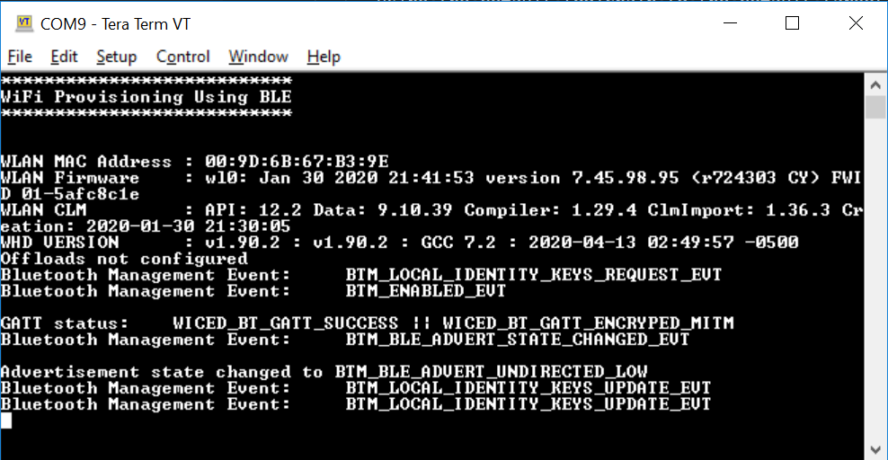

# Test Plan AnyCloud Example: Multi Beacon

|Test Case ID| Steps      | Expected result|
|------------|------------|----------------|
| 1          | **Basic Test**: Build and Program test: Build the project and program the kit.| The project builds and programs successfully. |
|2	         | **Basic Test**: *UART TEST* - After executing test#1, connect the kit to a PC and open terminal at 115200 baud. Press the reset button on kit.	| Terminal displays the following:|
|3           | **Basic Test** : *Bluetooth Advertisement test:* Once the test 2 is complete, use any BLE GAP Central app and scan.| You should be able to see bleProv|
|4           | **Advance Test** : *Bluetooth Connection test:* Once the test 3 is complete, use any BLE GAP Central app to connect to bleProv.| You should be able to conenct|
|5           | **Advance Test** : *Discover Attributes test:* Once the test 4 is complete discover all the attributes.| You should be able to see custom service with 4 characteristics|
|6           | **Advance Test** : *Password Write test:* Once the test 5 is complete try to write to characteristic with UUID ending in 0x64.| Write should fail|
|7           | **Advance Test** : *Pairing test:* Once the test 6 is complete try to pair.| Pairing is successful|
|8           | **Advance Test** : *Connection test:* Follow steps in README to connect to a WiFi network.| Connection successful|
|9           | **Advance Test** : *Disconnection test:* Follow steps in README to disconnect from the WiFi network.| Dicsonnection successful|
|10          | **Advance Test** : *Reconnection test:* Try to reconnect to the WiFi network by just sending connection command.| Reconnection successful|
|11          | **Advance Test** : *Wrong Data test:* Try to connect to the WiFi network by providing wrong WiFi credentials.| Connection unsuccessful|
|12          | **Advance Test** : *Reconnection test:* Try to connect to the WiFi AP by providing correct credentials.| Reconnection successful|
|13          | **Advance Test** : *Reset test:* Reset the device.| Device should automatically connect to the previous network and BLE advertisment should be off|
|14          | **Advance Test** : *Delete WiFi credentials test:* Press the user button on the board. Now reset the board| WiFi data should be deleted upon user button press. BLE ADV should start on reset|

> **Note:** Basic test category meant for quick sanity test of the example with any updated dependency assets. Advanced tests are to cover the complete example functionality when the implementation/design gets changed.

Test cases were executed using HEX files generated using the following combinations:

**IDE flow**: refers to testing by creating the project using the ModusToolbox IDE’s New project wizard, followed by programming using the Quick launch setting. Refer to the Readme’s "In Eclipse IDE for ModusToolbox" sections.

**CLI flow**: refers to testing by creating the project by downloading or cloning the project repo and building and programming from the CLI. See the Readme’s Operation -> Using CLI for build instructions.

**TOOLCHAIN** = Toolchain used for building the application (GCC_ARM), IAR is also supported but is having build issues so avoid testing on it.

**TARGET** = Supported kit target (See Readme for supported kits)